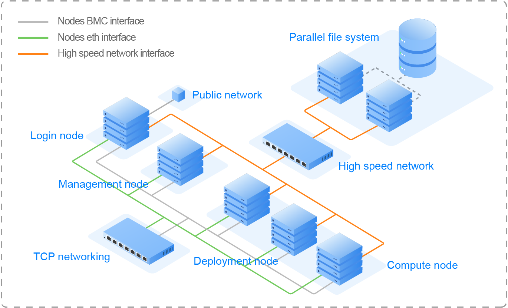

# OpenLiCO

#### Table of Contents

1. [Introduction](#introduction)
2. [Prerequisite](#prerequisite)
3. [Installation](#installation)
4. [Contributing](#contributing)
5. [License](#license)


## Introduction

OpenLiCO is an opensource infrastructure management software for high-performance computing (HPC). It provides features like cluster management and monitoring, job scheduling and management, cluster user management, account management, and file system management. With OpenLiCO, users can centralize resource allocation in one supercomputing cluster and carry out HPC jobs simultaneously. Users can perform operations by logging in to the management system interface with a browser, or by using command lines after logging in to a cluster login node with another Linux shell.




## Prerequisite

#### Docker >= 23.0.4

OpenLiCO is installed with docker. Please refer to [Install Docker Engine](https://docs.docker.com/engine/install/) to install Docker.

#### OpenHPC == 2.6.1

OpenHPC is a set of community-driven FOSS tools for Linux based HPC. Please refer to [OpenHPC WiKi](https://github.com/openhpc/ohpc/wiki/2.X) for more information.

#### MariaDB

MariaDB is a very fast and robust SQL database server. Please refer to [MariaDB website](https://mariadb.org/) for more information.

##### Create MariaDB database and user

```mariadb
# Enter MariaDB shell
mysql
# Create database
create database lico character set utf8 collate utf8_bin;
# Create user
create user '<USERNAME>'@'%' identified by '<PASSWORD>';
# Grant permissions to the user
grant ALL on lico.* to '<USERNAME>'@'%';
# Exit MariaDB shell
exit
```

##### Configure MariaDB limits

```bash
sed -i "/\[mysqld\]/a\max-connections=1024" /etc/my.cnf.d/mariadb-server.cnf

mkdir /usr/lib/systemd/system/mariadb.service.d

cat << eof > /usr/lib/systemd/system/mariadb.service.d/limits.conf
[Service]
LimitNOFILE=10000
eof

systemctl daemon-reload
systemctl restart mariadb
```

#### InfluxDB

InfluxDB is a scalable datastore for metrics, events, and real-time analytics. Please refer to [InfluxDB website](https://www.influxdata.com/) for more information.

##### Create InfluxDB database and user

```mariadb
# Enter InfluxDB shell
influx
# Create database lico
create database lico
# Use database
use lico
# Create an administrator user, ensure that the password is a string
create user <INFLUX_USERNAME> with password '<INFLUX_PASSWORD>' with all privileges
# Exit InfluxDB shell
exit
```

##### Edit configuration file

```bash
# Edit configuration file
sed -i '/# auth-enabled = false/a\ auth-enabled = true' /etc/influxdb/config.toml
# Restart InfluxDB
systemctl restart influxdb
```

#### (Optional) icinga2

A recommended monitoring system for OpenLiCO. Please refer to [icinga2 installation guide](https://icinga.com/docs/icinga-2/latest/doc/02-installation/) for installation and configuration.

##### After the general configuration, commands and services for the monitoring plugin need to be configured on management node

*Note: OpenLiCO Monitor is applied as the monitoring plugin in the example.*

**Add commands in the global template:**

- Create global template directory

  ```bash
  mkdir -p /etc/icinga2/zones.d/global-templates
  ```

- Download command configuration file from [here](./static/conf/icinga2/commands) for a specified scheduler.

- Move the command configuration file to `/etc/icinga2/zones.d/global-templates/commands.conf`

- Change the owner of the directory

  ```bash
  chown -R icinga:icinga /etc/icinga2/zones.d/global-templates
  ```

**Add services in the zones:**

- Create master directory

  ```bash
  mkdir -p /etc/icinga2/zones.d/master
  ```

- Download service configuration file from [here](./static/conf/icinga2/service.conf).

- Move the service configuration file to `/etc/icinga2/zones.d/master/service.conf`

- Change the owner of the directory and restart the service

  ```bash
  chown -R icinga:icinga /etc/icinga2/zones.d/master
  
  systemctl restart icinga2
  ```

**Create InfluxDB database for icinga2**

```mariadb
# Enter InfluxDB shell
influx
# Create database icinga
create database icinga
# Use database
use icinga
# Create an administrator user, ensure that the password is a string
create user <INFLUX_USERNAME> with password '<INFLUX_PASSWORD>' with all privileges
# Create retention policy
create retention policy "three_hour_only" on "icinga" duration 3h replication 1 default
# Exit InfluxDB shell
exit
```

**Edit InfluxDB configuration file**

```bash
# Edit configuration file
sed -i '/# index-version = "inmem"/a\ index-version = "tsi1"' /etc/influxdb/config.toml
# Restart InfluxDB
systemctl restart influxdb
```

#### (Optional) OpenLiCO Monitor

A recommended monitoring plugin for OpenLiCO, based on icinga2. Please refer to [openlico-monitor README](https://github.com/lenovo/openlico-monitor) for installation.


## Installation

OpenLiCO is installed with docker, and is a project that separates front-end and back-end. The installation requires the following repositories:

- openlico: OpenLiCO source code repository.
- openlico-portal: OpenLiCO front-end repository.
- openlico-docker: The repository for deploying OpenLiCO container.

For how to deploy OpenLiCO container, please refer to [openlico-docker README](https://github.com/lenovo/openlico-docker).


## Contributing

- Sign out Individual/Non-Commercial Contributor License Agreement (CLA) if you will be contributing on behalf of yourself in individual capacity or on behalf of a non-commercial entity, e.g. a University or a non-profit organization. You can find the [CLA here](./static/docs/OpenLiCO_Individual_Non-Commercial_CLA.pdf).
- If you are contributing on behalf of your employer, other than a non-commercial entity, we’ll need a signed copy of our Corporate Contributor License Agreement (CCLA). You can find the [CLA here](./static/docs/OpenLiCO_Corporate_CLA.pdf).
- Fork the repo, make your changes, and open pull requests!


## License

Licensed under the Apache License, Version 2.0 (the "License"); you may not use this file except in compliance with the License. You may obtain a copy of the License at

http://www.apache.org/licenses/LICENSE-2.0

Unless required by applicable law or agreed to in writing, software distributed under the License is distributed on an "AS IS" BASIS, WITHOUT WARRANTIES OR CONDITIONS OF ANY KIND, either express or implied. See the License for the specific language governing permissions and limitations under the License.